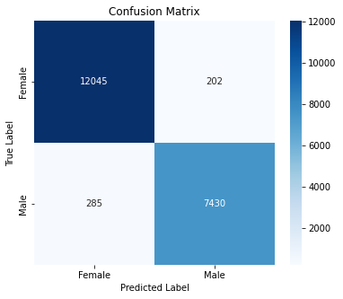
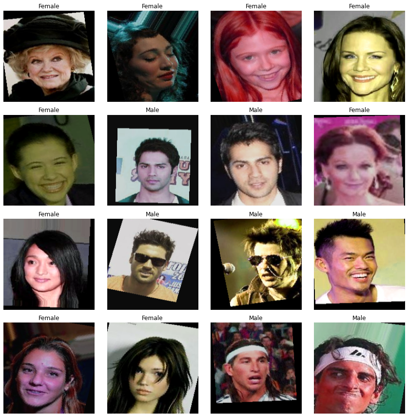
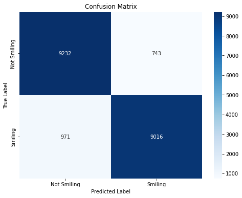
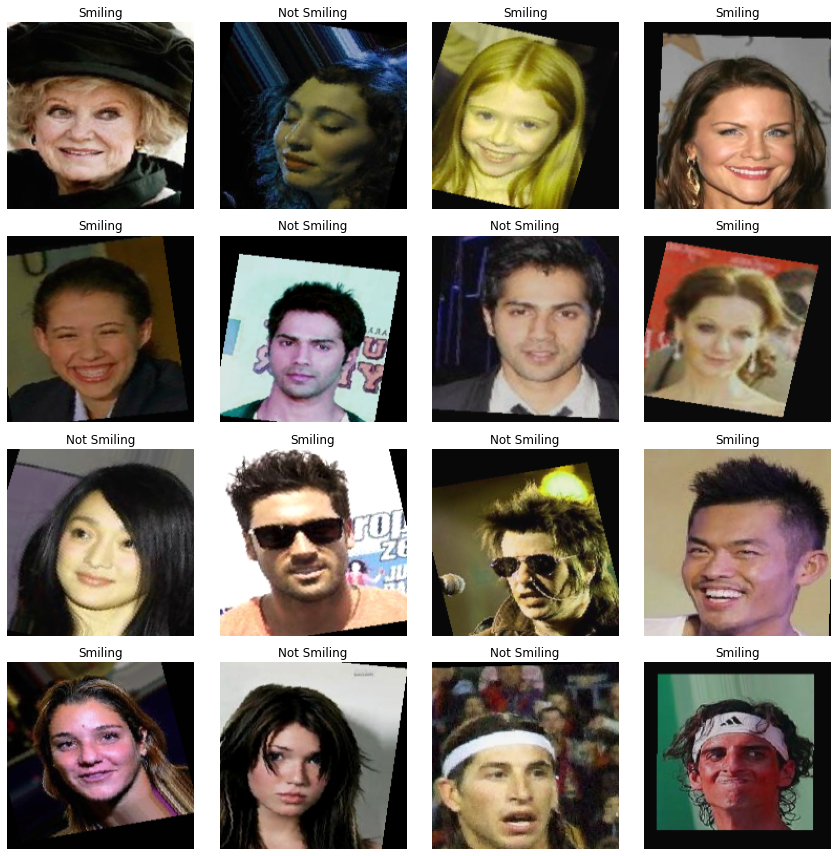
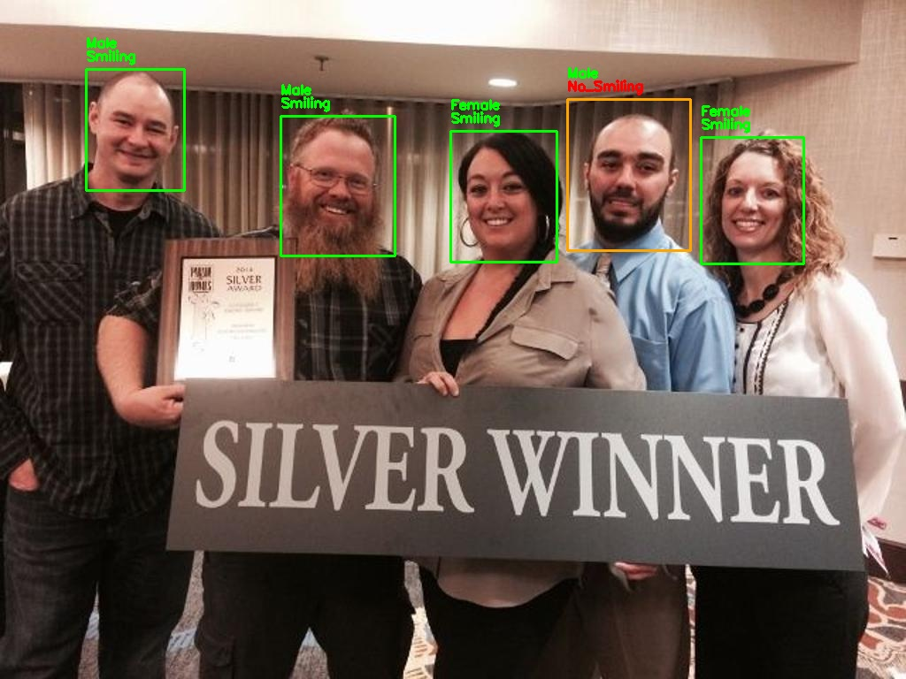
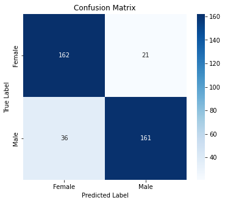
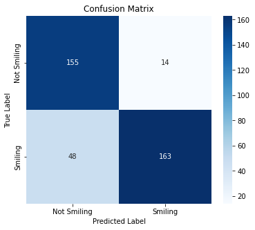

# Facial Features Recognition

Projekt ten służy do rozpoznawania cech twarzy, w tym płci oraz uśmiechu, przy użyciu modeli głębokiego uczenia (CNN oraz ResNet50). W projekcie wykorzystujemy zbiory CelebA oraz WIDERFace do trenowania i testowania modeli. Dodatkowo umożliwiają detekcję cech twarzy w czasie rzeczywistym. Kod został napisany w Pythonie przy użyciu PyTorch i PyTorch Lightning.

---

## 🏗️ Architektura modeli

### Model rozpoznający płeć (**GenderCNN**)

- Konwolucyjna sieć neuronowa (CNN) składająca się z czterech bloków:
  - Warstwy **Conv2D**, **ReLU**, **BatchNorm**, **MaxPooling**
  - W pełni połączone warstwy klasyfikujące
- Normalizacja danych do zakresu **[-1,1]**
- Augmentacja: odbicia, obrót **(-15° do 15°)**, przesunięcie **(0-10% wymiaru)**, zmiany jasności, kontrastu, nasycenia i odcienia
- **Early stopping** (przerwanie trenowania po 5 epokach bez poprawy)

### Model rozpoznający uśmiech (**SmileResNet**)

- **ResNet50** z transfer learningiem
- **Fine-tuning** 4 ostatnich warstw
- Taki sam proces **augmentacji** jak w **GenderCNN**

---

## 📊 Wyniki modeli

### Wyniki na zbiorze CelebA:

#### Rozpoznawanie płci:

- **Dokładność**: 98%
- **Precyzja**: 97% (mężczyźni), 98% (kobiety)
- **Czulość**: 96% (mężczyźni), 98% (kobiety)
- **F1-score**: 97% (mężczyźni), 98% (kobiety)





#### Rozpoznawanie uśmiechu:

- **Dokładność**: 91%
- **Precyzja**: 90% (nieuśmiechnięci), 92% (uśmiechnięci)
- **Czułość**:  93% (nieuśmiechnięci), 90% (uśmiechnięci)
- **F1-score**: 92% (nieuśmiechnięci), 91% (uśmiechnięci)





### Wyniki na zbiorze WIDERFace:



#### Rozpoznawanie płci:

- **Dokładność**: 85%
- **Precyzja**: 88% (mężczyźni), 82% (kobiety)
- **Czułość**: 82% (mężczyźni), 89% (kobiety)
- **F1-score**:  85% (mężczyźni), 85% (kobiety)



#### Rozpoznawanie uśmiechu:

- **Dokładność**: 84%
- **Precyzja**: 76% (nieuśmiechnięci), 92% (uśmiechnięci)
- **Czułość**: 92% (nieuśmiechnięci), 77% (uśmiechnięci)
- **F1-score**: 83% (nieuśmiechnięci), 84% (uśmiechnięci)



---

## 📂 Struktura repozytorium

facial-features-recognition\
|── src\
│  |── models\
│  │  |── gender_cnn.py\
│  │  |── resnet50_smile.py\
│  |── training\
│  │  |── train_gender.py\
│  │  |── train_smile.py\
│  |── inference\
│  │  |── test_widerface.py\
│  │  |── webcam_detection.py\
│ \
|── data\
│  |── scripts\
│  |  |── download_celeba.py\
│  │  |── download_widerface.py\
│  |── selected_with_bboxes.txt\
│ \
|── saved_models\
|  |── gender_cnn.pth\
|  |── resnet50_smile.pth\
│ \
|── docs\
│   |── images\
│   │   |── gender_cnn_architecture.png\
│   │   |── resnet_smile_architecture.png\
│   │   |── gender_confusion_matrix_celeba.png\
│   │   |── smile_confusion_matrix_celeba.png\
│   │   |── gender_confusion_matrix_widerface.png\
│   │   |── smile_confusion_matrix_widerface.png\
│ \
|── README.md\
|── .gitignore\
|── requirements.txt\

---

## 🚀 Instalacja

1. **Sklonuj repozytorium:**

   ```bash
   git clone https://github.com/TwojUserName/facial-features-recognition.git
   cd facial-features-recognition

2. **Utwórz i aktywuj środowisko wirtualne (opcjonalnie, ale zalecane):**
   
- Na Windows:
     
   ```bash
   python -m venv venv
   venv\Scripts\activate
   ```
   
- Na Linux/macOS:
     
   ```bash
   python3 -m venv venv
   source venv/bin/activate
   ```

3. **Zainstaluj wymagane pakiety:**
   
   ```bash
   pip install -r requirements.txt
   ```

---

## 📥 Pobieranie danych

### CelebA

   Użyj skryptu do pobierania CelebA, który pobiera obrazy i pliki tekstowe z Google Drive:
   
   ```bash
   python data/scripts/download_celeba.py
   ```

   *Pliki zostaną zapisane w folderze `data/celeba/`.*
   
> **Uwaga:** W przypadku problemów z automatycznym pobieraniem przez `gdown`, pobierz pliki ręcznie (np. z Google Drive lub innego źródła) i umieść je w odpowiednich folderach.

### WIDERFace (tylko dane treningowe)

   Użyj skryptu do pobierania zbioru WIDERFace (trening) oraz anotacji:
   
   ```bash
   python data/scripts/download_widerface.py
   ```

   *Pliki zostaną zapisane w folderze `data/WIDERFace/`.*
   
> **Uwaga:** W przypadku problemów z automatycznym pobieraniem przez 'gdown', pobierz pliki ręcznie (np. z Kaggle lub innego źródła) i umieść je w odpowiednich folderach.

---

## ⚙️ Uruchamianie modeli

### Trening

- **Trening modelu rozpoznawania płci:**

   ```bash
   python src/training/train_gender.py
   ```

- **Trening modelu wykrywania uśmiechu:**

  ```bash
  python src/training/train_smile.py
  ```

### Testowanie

- **Testowanie na zbiorze WIDERFace:**

  ```bash
  python src/inference/test_widerface.py
  ```

- **Predykcja w czasie rzeczywistym (kamera):**

  ```bash
  python src/inference/webcam_detection.py
  ```

---

## 📚 Zawartość repozytorium

- `src/models/`: Zawiera definicje modeli, w tym `GenderCNNLightning` oraz `SmileResNetLightning`.
- `src/training/`: Skrypty treningowe dla modeli (płeć i uśmiech).
- `src/inference/`: Skrypty do testowania modeli – zarówno na zbiorze WIDERFace, jak i w czasie rzeczywistym.
- `data/scripts/`: Skrypty do automatycznego pobierania i rozpakowywania danych (CelebA i WIDERFace).
- `data/selected_with_bboxes.txt`: Plik z anotacjami, wykorzystywany przy testowaniu modeli na zbiorze WIDERFace.
- `saved_models/`: Folder przechowujący zapisane modele.
- `requirements.txt`: Lista zależności niezbędnych do uruchomienia projektu.
- `.gitignore`: Konfiguracja, aby wykluczyć niepotrzebne pliki (np. dane, wirtualne środowiska, pliki cache).

